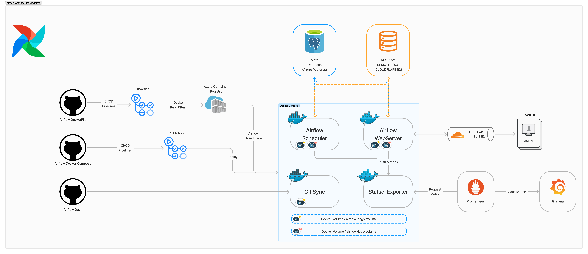

# Apache Airflow Docker Compose
---
이 프로젝트는 Apache Airflow를 Docker Compose 환경에서 실행하기 위한 설정을 포함하며, 
확장 가능한 데이터 파이프라인 관리 및 워크플로우 자동화를 목표로 합니다. 

현재 Airflow는 **LocalExecutor** 기반으로 설계되어 있으며, Webserver와 Scheduler 서버로만 구성되어 있습니다.

LocalExecutor는 단일 호스트에서의 병렬 처리를 지원하며, 중소규모의 ETL 워크플로 실행에 적합한 구조를 제공합니다. 
그러나 태스크의 수가 많아지거나, 더욱 복잡한 ETL 작업 및 클러스터 기반의 고성능 처리가 요구되는 경우에는 CeleryExecutor 또는 KubernetesExecutor로 전환하여 확장할 수 있습니다.

이와 같은 설계 전환을 통해 아래와 같은 확장이 가능합니다:
- Worker 서버 추가: 분산 환경에서 태스크를 처리할 수 있도록 클러스터를 구성하여 병렬 처리 성능을 극대화합니다.
- Trigger 서버 추가: 태스크 트리거링을 전담하는 서버를 도입하여 효율성을 높입니다.

아래는 아키텍처 구성 및 주요 서비스에 대한 설명입니다.

## 아키텍처 구성 요소

1. **Airflow Webserver**
    - Airflow의 UI를 제공하는 서비스로, DAG 상태 확인, 트리거 및 로그를 확인할 수 있습니다.
    - Healthcheck: /health 엔드포인트를 통해 상태 점검.

2. **Airflow Scheduler**
    - Airflow DAG의 태스크를 스케줄링하고 트리거하는 핵심 서비스입니다.
    - Healthcheck: /health 엔드포인트를 통해 상태 점검.

3. **Airflow Init**
    - 초기화 작업을 담당하며, 데이터베이스 마이그레이션 및 기본 사용자 계정을 생성합니다.
    - 주요 초기화 작업:
      - 데이터베이스 마이그레이션 (airflow db migrate)
      - 기본 Admin 사용자 생성

4. **StatsD Exporter**
    - 메트릭을 수집하여 Prometheus와 통합하기 위한 StatsD Exporter.
    - Airflow에서 생성된 메트릭을 외부 모니터링 시스템에 전달.

5. **Git Sync**
    - Git 저장소에서 Airflow DAG 파일을 동기화합니다.
    - Sync-dag : https://github.com/wooyongk/data-engineering-project/tree/main/airflow/dags

## 아키텍처 다이어그램

## 살펴보기

**URL**: https://dep-airflow.wooyong.cc/home

**ID**: viewer

**PASSWORD**: viewer

---

